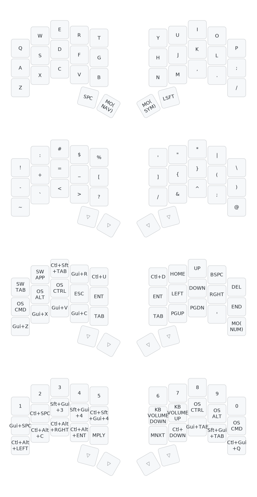

# Keyboard Layouts

Custom QMK keymaps for two split boards:

- `36key/keymap.c` - 36-key layout (`LAYOUT_split_3x5_3`)
- `34key/keymap.c` - 34-key layout (`LAYOUT_split_3x5_2`)

## Shared behavior

- Oneshot mods: `OS_SHFT`, `OS_CTRL`, `OS_ALT`, `OS_CMD`
- Swapper keys:
  - `SW_APP`: Cmd+Tab switcher (`Cmd` stays held while you keep pressing `Tab`)
  - `SW_WIN`: Alt+Tab switcher (`Alt` stays held while you keep pressing `Tab`)
  - `SW_TAB`: Ctrl+Tab switcher (`Ctrl` stays held while you keep pressing `Tab`)
- Hold `OS_SHFT` while swapping to go in reverse
- Tri-layer: holding `NAV` + `SYM` activates `NUM`
- `36key/keymap.c` uses its extra thumb key for a `WM` layer with AeroSpace and Kitty shortcuts

## 34-key layout

The full keymap diagram lives in `assets/my_keymap.svg`.

